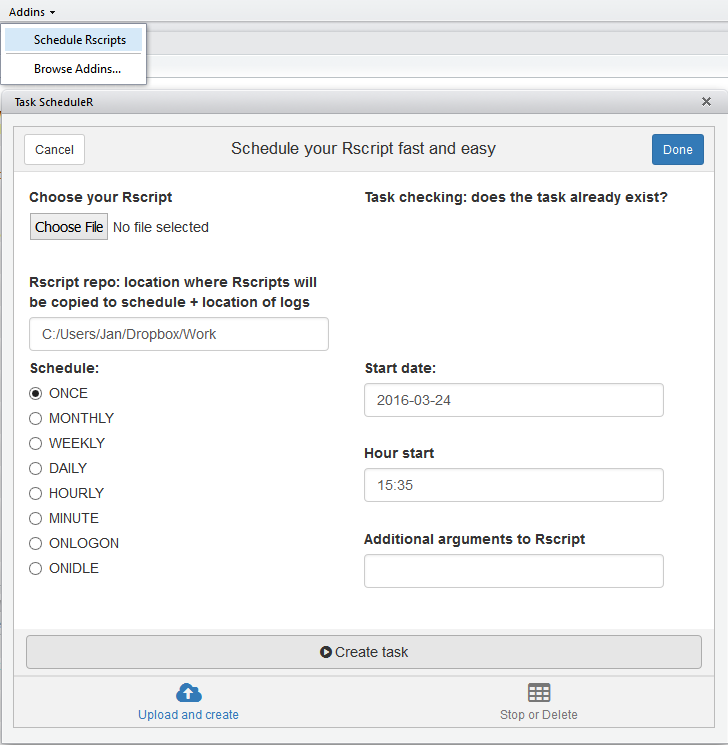

taskscheduleR
=========

 

Schedule R scripts/processes with the Windows task scheduler. This allows R users working on Windows to automate R processes on specific timepoints from R itself.


Basic usage
-----------

This R package allows to 
* Get the list of scheduled tasks
* Remove a task
* Add a task
  + A task is basically a script with R code which is run through Rscript
  + You can schedule tasks 'ONCE', 'MONTHLY', 'WEEKLY', 'DAILY', 'HOURLY', 'MINUTE', 'ONLOGON', 'ONIDLE'
  + The task log contains the stdout & stderr of the Rscript which was run on that timepoint. This log can be found at the same folder as the R script

Example usage:

```
library(taskscheduleR)
myscript <- system.file("extdata", "helloworld.R", package = "taskscheduleR")

## run script once within 62 seconds
taskscheduler_create(taskname = "myfancyscript", rscript = myscript, 
  schedule = "ONCE", starttime = format(Sys.time() + 62, "%H:%M"))
## run script every day at 09:10
taskscheduler_create(taskname = "myfancyscriptdaily", rscript = myscript, 
  schedule = "DAILY", starttime = "09:10")

## get a data.frame of all tasks
tasks <- taskscheduler_ls()
str(tasks)

## delete the tasks
taskscheduler_delete(taskname = "myfancyscript")
taskscheduler_delete(taskname = "myfancyscriptdaily")
```

When the task has run, you can look at the log which contains everything from stdout and stderr. The log file is located at the directory where the R script is located.

```
## log file is at the place where the helloworld.R script was located
system.file("extdata", "helloworld.log", package = "taskscheduleR")
```

RStudio add-in
-----------

The package contains also an RStudio add-in. If you install the package and use RStudio version 0.99.893 or later you can just click to schedule a task. Just click Addins > Schedule Rscripts. Many thanks to  

 


Install
-----------

Install the latest version from github:
```
devtools::install_github("jwijffels/taskscheduleR")
```

Or from www.datatailor.be
```
install.packages('data.table')
install.packages('knitr')
install.packages("taskscheduleR", repos = "http://www.datatailor.be/rcube", type = "source")
```

If you want the RStudio add-in to work, also install miniUI and shiny
```
install.packages('miniUI')
install.packages('shiny')
```
